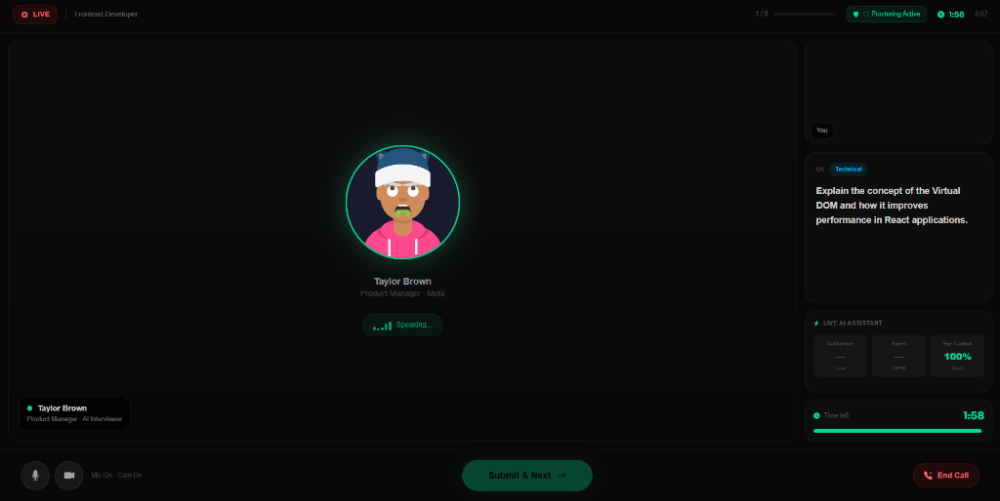
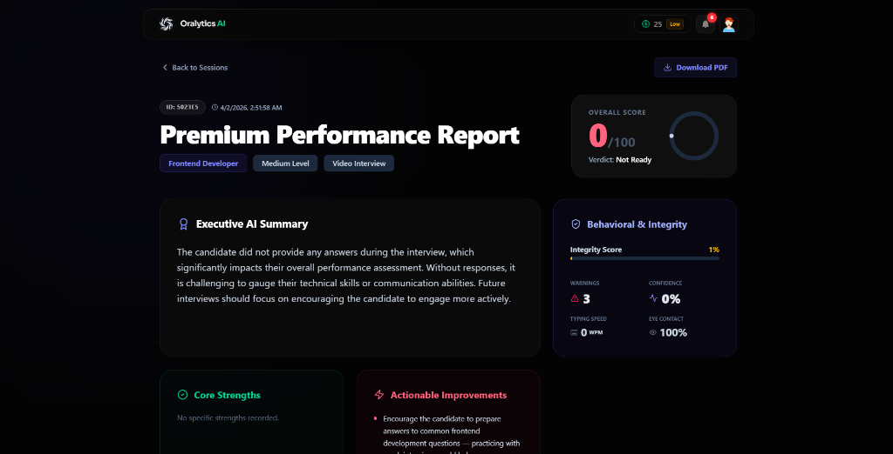
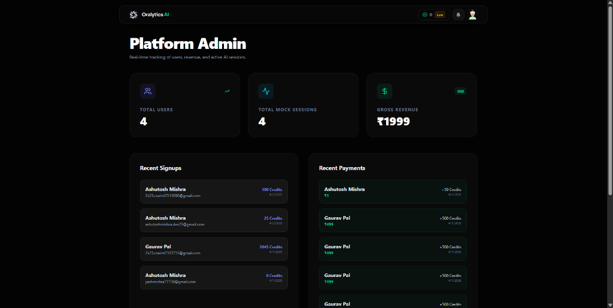
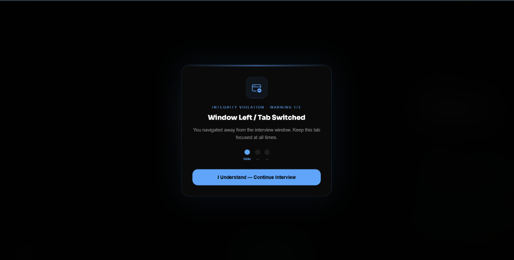

<div align="center">
  
  <h1>Oralytics AI 🚀</h1>
  <p><strong>Next-Generation AI Interview & Placement Prep Platform</strong></p>

  [](https://reactjs.org/)
  [](https://nodejs.org/)
  [](https://fastapi.tiangolo.com/)
  [](https://www.mongodb.com/)
  [](https://tailwindcss.com/)
</div>

<br />

> **Oralytics AI** is an intelligent, full-stack platform designed to help students and professionals ace their technical interviews. It generates dynamic, context-aware interview questions by cross-referencing candidate resumes with live job descriptions, scores their answers natively, and offers predictive analytics for placements.

---

## 🌟 Key Features

*   **🎙️ Multi-Modal AI Mock Interviews:** Practice via Live Video, Voice Check, or pure Text interfaces. Dynamic questions adapt based on resume context (parsed via Mammoth/PDF-parse).
*   **📊 Premium Analytics & Reports:** Detailed breakdowns (Content vs Clarity), AI executive summaries, and performance history with beautiful UI dashboards.
*   **👁️ Proctoring & Behavioral Engine:** Evaluates candidate integrity score, tracks eye-contact variance, typing WPM speed, and records application tab violations during interviews.
*   **🚀 Placement Predictor (Microservice):** Dedicated Python-FastAPI machine learning service integrated to analyze technical prowess and output a probability percentage of job placement.
*   **💳 Credits & Payment Gateway:** Fully-automated secure economy system powered by **Razorpay** Webhooks to manage mock-interview credits securely.
*   **👑 Admin Dashboard:** Role-based access control (RBAC) panel showing global metrics, gross revenue, aggregated session counts, and live signups.

---

## 📸 Screenshots

*(Replace the placeholder links below with your actual screenshot URLs)*

| Role-based AI Interview 🧠 | Premium Feedback Report 📈 |
| :-------------------------: | :--------------------------: |
|  |  |

| Admin Dashboard 👑 | Live Proctoring 👁️ |
| :-------------------------: | :--------------------------: |
|  |  |

---

## 🏗️ System Architecture

Our platform follows a robust Microservices-like pattern:
1.  **Frontend Module:** React + Vite + Framer Motion (Deployed on Vercel)
2.  **Core Backend API:** Node.js + Express + MongoDB (Deployed on Render)
3.  **Machine Learning Service:** FastAPI + Scikit-Learn/XGBoost (Deployed on Render)
4.  **LLM / AI Engine:** Integration with OpenRouter/Gemini for low-latency reasoning

<div align="center">
  
</div>

---

## 🚀 Getting Started (Local Development)

### 1. Requirements
*   Node.js (v18+)
*   Python (v3.9+)
*   MongoDB Instance

### 2. Environment Variables Setup

You'll need to create two `.env` files. 

**For `server/.env`:**
```env
PORT=8080
MONGODB_URL=your_mongodb_cluster_uri
JWT_SECRET=your_jwt_strong_secret

# AI & Media
OPENROUTER_API_KEY=your_openrouter_or_gemini_key
CLOUDINARY_CLOUD_NAME=your_cloudinary_name
CLOUDINARY_API_KEY=your_cloudinary_key
CLOUDINARY_API_SECRET=your_cloudinary_secret

# Payments (Razorpay)
RAZORPAY_KEY_ID=your_razorpay_key
RAZORPAY_KEY_SECRET=your_razorpay_secret
RAZORPAY_WEBHOOK_SECRET=your_webhook_secret
UPI_VPA=your_upi_vpa

# Service Linking
FASTAPI_URL=http://127.0.0.1:8000
ADMIN_EMAIL=your_email@gmail.com
```

**For `client/.env`:**
```env
VITE_API_URL=http://localhost:8080
VITE_FIREBASE_APIKEY=firebase_api_key
VITE_FIREBASE_AUTHDOMAIN=firebase_domain
VITE_FIREBASE_PROJECTID=firebase_project_id
VITE_FIREBASE_STORAGEBUCKET=storage_bucket
VITE_FIREBASE_MESSAGINGSENDERID=sender_id
VITE_FIREBASE_APPID=app_id
```

### 3. Installation & Run

**Start the the Backend (Node Server):**
```bash
cd server
npm install
npm run dev
```

**Start the Frontend (React):**
```bash
cd client
npm install
npm run dev
```

**Start the ML Server (FastAPI):**
```bash
cd placement-predictor/backend
pip install -r requirements.txt
uvicorn app:app --reload
```

---

## 🔒 Security Practices Built-in

*   **API Rate Limiting:** Prevent AI credit drainage using IP-based request rate limiting.
*   **Webhook Signature Validation:** Prevents client-side payment forgery via Razorpay's SHA256 HMAC validation.
*   **Middleware Protection:** Granular HTTP route protection using `isAuth` (JWT bearer) and `isAdmin` policies.

---

## 👨‍💻 Development Team

Developed as a Final Year Capstone Project by:
- **Yash Mishra** - Backend Architecture, Architecture Setup, & AI Implementations

---

<div align="center">
  <p>Made with ❤️ for the Developer & Student Community.</p>
</div>
